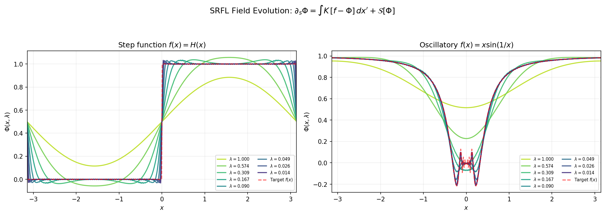
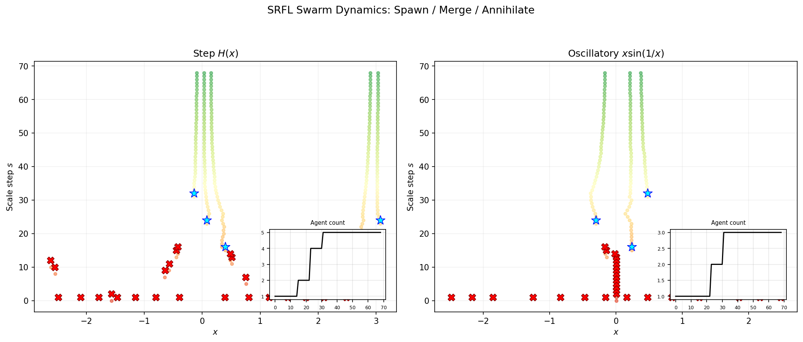
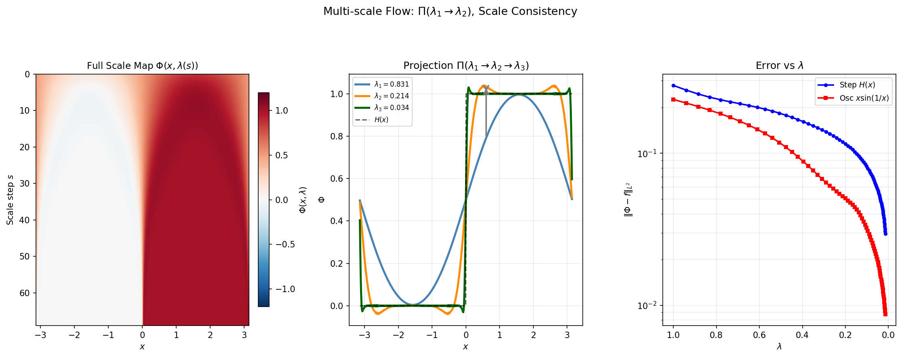

# Swarm Renormalization Field Learning (SRFL)

<p align="center">
  
</p>

> **A non-local, multi-scale, defect-driven learning paradigm — without gradient descent.**

[](https://www.python.org/)
[](LICENSE)
[](https://numpy.org/)
[](https://matplotlib.org/)

---

## Overview

**SRFL** replaces the parameter–gradient pair `(θ, ∇L)` of conventional learning with a **field–flow pair** `(Φ(x,λ), ∂Φ/∂s)` governed by an integro-differential equation that is:

- **Non-local** — governed by a Gaussian kernel `K(x, x′, λ)` integrating over all of `Ω`  
- **Multi-scale** — `λ` flows from coarse (`λ → ∞`) to fine (`λ → 0`) via a scale semigroup  
- **Defect-driven** — instabilities auto-generate defect operators (`Ŝ`, `Ô`, `Ĉ`) from a formal algebra  
- **Swarm-coordinated** — agents spawn, merge, and annihilate in response to field curvature  
- **No back-propagation** — learning is the stationary point of a 4-term action functional `𝒜`

---

## Theory at a Glance

The core evolution equation:

```
∂Φ/∂s(x,s) = ∫_Ω K(x,x′,λ(s)) [f(x′) − Φ(x′,s)] dx′  +  𝒮[Φ](x,s)
```

| Symbol | Meaning |
|--------|---------|
| `Φ(x,λ)` | Scale-dependent learning field |
| `K(x,x′,λ)` | Gaussian non-local kernel, FWHM = `2√(2ln2)·λ` |
| `𝒢[Φ] = tanh(Φ)` | Nonlinear functional response |
| `𝒮[Φ]` | Singularity generator — fires when `\|∂²Φ\| > κ` |
| `Dᵢ ∈ 𝒟` | Defect: step `Ŝ`, oscillatory `Ô`, conditional `Ĉ` |
| `𝒜` | Action functional (data + scale + symmetry + complexity) |

---

## Repository Structure

```
srfl/
├── src/srfl/                  # Core library
│   ├── __init__.py
│   ├── kernel.py              # Non-local Gaussian kernel
│   ├── field.py               # Field evolution engine
│   ├── defects.py             # Defect algebra (Ŝ, Ô, Ĉ)
│   ├── swarm.py               # Agent swarm model
│   ├── action.py              # Action functional 𝒜
│   └── multiscale.py          # Scale projection Π(λ₁→λ₂)
├── experiments/
│   ├── run_step.py            # Experiment A: step function H(x)
│   ├── run_oscillatory.py     # Experiment B: x·sin(1/x)
│   └── run_all.py             # Run all experiments + generate figures
├── scripts/
│   └── generate_figures.py   # Standalone figure generation
├── tests/
│   ├── test_kernel.py
│   ├── test_defects.py
│   ├── test_swarm.py
│   └── test_action.py
├── paper/
│   └── srfl_paper.tex         # Full LaTeX paper
├── figures/                   # Generated PNG outputs
├── notebooks/
│   └── srfl_demo.ipynb        # Interactive walkthrough
├── .github/workflows/
│   └── ci.yml                 # GitHub Actions CI
├── requirements.txt
├── setup.py
├── pyproject.toml
├── .gitignore
└── LICENSE
```

---

## Quick Start

```bash
# Clone
git clone https://github.com/cosmobishal/srfl.git
cd srfl

# Install
pip install -e .

# Run all experiments and generate all figures
python experiments/run_all.py

# Or run individual experiments
python experiments/run_step.py
python experiments/run_oscillatory.py
```

---

## Results

| Target | SRFL Behaviour | Neural Net Failure Mode |
|--------|---------------|------------------------|
| `H(x)` — Heaviside step | Generates step defect `Ŝ_{x=0}`, no Gibbs oscillations | `O(1/ε)` neurons for ε-accuracy; Gibbs-type ringing |
| `x·sin(1/x)` | Spawns nested oscillatory defects `Ô_ε` at `x=0` | Infinite frequency content → finite-arch. failure near origin |

<p align="center">
  
</p>
<p align="center">
  
</p>

---

## Paper

The full theoretical paper is in [`paper/srfl_paper.tex`](paper/srfl_paper.tex).  
Compile with:

```bash
cd paper && pdflatex srfl_paper.tex && pdflatex srfl_paper.tex
```

---

## Citation

```bibtex
@article{neupane2026srfl,
  title   = {Swarm Renormalization Field Learning (SRFL):
             A Non-local, Multi-scale, Defect-driven Learning Paradigm},
  author  = {Neupane, Bishal},
  year    = {2026},
  note    = {Preprint, Astronomy Squad of Koshi},
  email   = {cosmobishal@gmail.com}
}
```

---

## Author

**Bishal Neupane** · Astronomy Squad of Koshi · [cosmobishal@gmail.com](mailto:cosmobishal@gmail.com)

---

## License

MIT — see [LICENSE](LICENSE).
